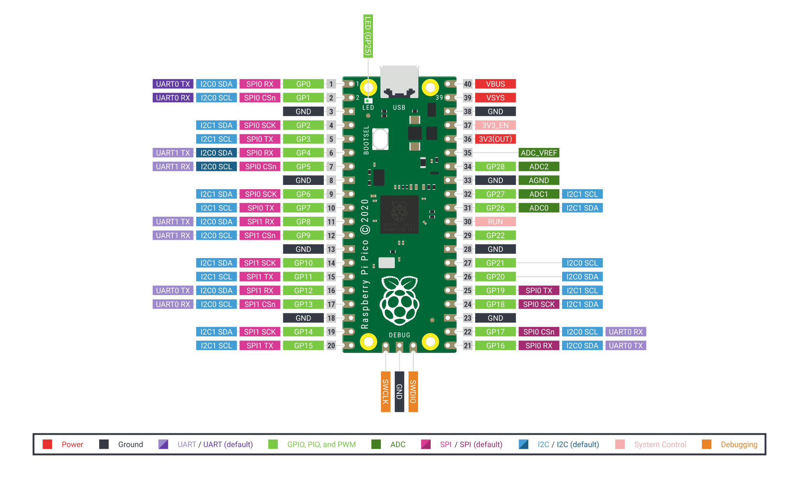

# Raspberry Pi Pico

µc
{: .label }

> → [RASPBERRY PI PICO](/wiki/Pinouts/BOARDS/RASPBERRY%20PI%20PICO)

## Pinout

## Specs
- Chip: [[RP2040]]
- 26x multifunktionale GPIO-Pins
- 2x SPI, 2x I2C, 2x UART, 3x 12-Bit-ADC, 16x steuerbare PWM-Kanäle

## Programming
### Micropython
- [[raspberry-pi-pico-python-sdk.pdf]]
- [https://www.raspberrypi.com/documentation/microcontrollers/micropython.html](https://www.raspberrypi.com/documentation/microcontrollers/micropython.html)

### Circuitpython

### C/C++ SDK
- [https://www.raspberrypi.com/documentation/microcontrollers/c_sdk.html](https://www.raspberrypi.com/documentation/microcontrollers/c_sdk.html)

### Arduino C/C++ platform
- [https://github.com/earlephilhower/arduino-pico](https://github.com/earlephilhower/arduino-pico)

## Files

- Tools
	- nuke
		- [flash_nuke.uf2](./files/Tools/nuke/flash_nuke.uf2)
		- [nuke_ReadMe.md](./files/Tools/nuke/nuke_ReadMe)
- [pico-datasheet.pdf](./files/pico-datasheet.pdf)
- [Pico-R3-Fritzing.fzpz](./files/Pico-R3-Fritzing.fzpz)

... more files to come